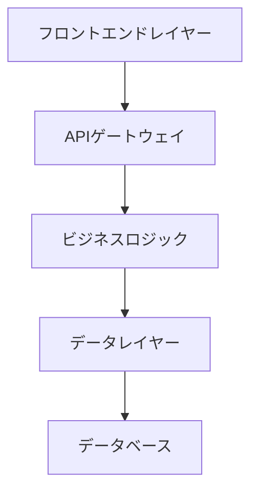
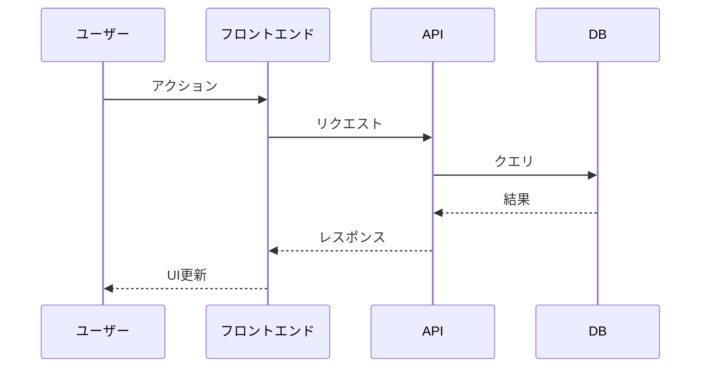
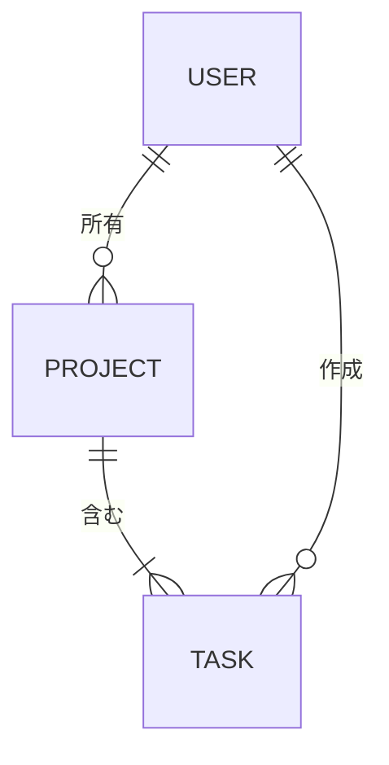

# 技術設計

機能の包括的な技術設計を作成：**$ARGUMENTS**

## インタラクティブ承認：要件レビュー

**重要**：設計は要件がレビューされ承認された後にのみ生成できます。

### 要件レビュープロセス

- 要件文書：@.kiro/specs/$ARGUMENTS/requirements.md
- 仕様書メタデータ：@.kiro/specs/$ARGUMENTS/spec.json

**インタラクティブ承認プロセス**：

1. **要件の存在確認** - requirements.md が生成されていることを確認
2. **人間レビューのプロンプト** - ユーザーに質問：「requirements.md をレビューしましたか？ [y/N]」
3. **'y'（はい）の場合**：要件を承認するため spec.json を自動更新し、設計生成に進む
4. **'N'（いいえ）の場合**：実行を停止し、まず requirements.md をレビューするようユーザーに指示

**ユーザーがレビューを確認したときの spec.json での自動承認更新**：

```json
{
  "approvals": {
    "requirements": {
      "generated": true,
      "approved": true // ← ユーザーが確認時に自動的にtrueに設定
    }
  },
  "phase": "requirements-approved"
}
```

**ユーザーインタラクション例**：

```
📋 設計生成前に要件レビューが必要です。
📄 レビューしてください：.kiro/specs/feature-name/requirements.md
❓ requirements.mdをレビューしましたか？ [y/N]: y
✅ 要件が自動承認されました。設計生成に進みます...
```

## コンテキスト分析

### 要件基盤

**重要**：設計は承認された要件文書の上に構築される必要があります。

- **要件文書**：@.kiro/specs/$ARGUMENTS/requirements.md
- **EARS 形式要件**：受入基準を持つ各要件
- **ユーザーストーリーマッピング**：設計コンポーネントは特定のユーザーストーリーに対応する必要があります
- **制約と受入基準**：技術的決定に反映される必要があります

**必須確認**：進行前に requirements.md が存在し承認されていることを確認してください。

### ステアリングコンテキスト

- 現在のアーキテクチャ：@.kiro/steering/structure.md
- テクノロジースタック：@.kiro/steering/tech.md
- プロダクト制約：@.kiro/steering/product.md

### 現在の仕様書コンテキスト

- 現在の設計：@.kiro/specs/$ARGUMENTS/design.md
- 仕様書メタデータ：@.kiro/specs/$ARGUMENTS/spec.json

## タスク：技術設計の作成

**前提条件確認済み**：要件が承認され、設計フェーズの準備が整っています。

### 調査・研究プロセス

**必須**：設計プロセス中に調査と研究を実施：

1. **技術調査**

   - テクノロジースタックの現在のベストプラクティスを調査
   - セキュリティ考慮事項と最新標準を調査
   - パフォーマンスベンチマークとスケーリングアプローチをレビュー
   - 既存アーキテクチャとの統合パターンを検討

2. **コンテキスト構築**

   - 会話スレッドで調査コンテキストを構築
   - 設計決定に影響する主要な発見を文書化
   - 参考資料のソースと関連リンクを引用
   - アーキテクチャ選択に影響する洞察を要約

3. **要件分析**
   - 各設計コンポーネントを特定の EARS 要件にマッピング
   - すべてのユーザーストーリーが技術設計で対応されていることを確認
   - 提案されたソリューションで受入基準が満たせることを検証
   - 要件と技術的実現可能性の間のギャップを特定

### 設計文書生成

調査結果を取り入れた、spec.json で指定された言語での包括的な設計文書を生成：

### 1. 設計文書構造

spec.json で指定された言語で design.md を作成（`@.kiro/specs/$ARGUMENTS/spec.json`の"language"フィールドを確認）：

````markdown
# 技術設計

## 概要

[requirements.md の主要要件を参照した実装アプローチの技術概要]

## 要件マッピング

### 設計コンポーネントのトレーサビリティ

各設計コンポーネントは特定の要件に対応：

- **[コンポーネント 1]** → REQ-X.X：[EARS 要件参照]
- **[コンポーネント 2]** → REQ-Y.Y：[EARS 要件参照]
- **[統合レイヤー]** → REQ-Z.Z：[EARS 要件参照]

### ユーザーストーリーカバレッジ

[requirements.md のすべてのユーザーストーリーが対応されていることを確認]

- ユーザーストーリー 1：[設計がこのストーリーにどう対応するか]
- ユーザーストーリー 2：[このストーリーの技術的アプローチ]

## アーキテクチャ

[高レベルシステムアーキテクチャと技術決定]


````

### テクノロジースタック

[調査結果と要件分析に基づく]

- **フロントエンド**：[React/Vue/Next.js] + [TypeScript]
- **バックエンド**：[FastAPI/Express/Django] + [言語]
- **データベース**：[PostgreSQL/MySQL/MongoDB]
- **認証**：[JWT/OAuth/Auth0]
- **テスト**：[Jest/pytest] + [Testing Library/Playwright]
- **デプロイメント**：[Docker/Vercel/AWS]

### アーキテクチャ決定理由

[調査に基づく主要技術選択の根拠を文書化]

- **[フロントエンドフレームワーク]を選ぶ理由**：[調査ベースの正当性]
- **[バックエンド技術]を選ぶ理由**：[パフォーマンス、スケーラビリティ、チーム専門性の考慮]
- **[データベース選択]を選ぶ理由**：[データモデル要件、一貫性ニーズ、スケーリングパターン]
- **[認証方法]を選ぶ理由**：[セキュリティ要件、統合機能、ユーザーエクスペリエンス]

## データフロー

[システムを通じてデータがどのように流れるかの説明]

### 主要ユーザーフロー

上位 1-3 のユーザーフローのシーケンス図を含む：



## コンポーネントとインターフェース

包括的なコンポーネント分解を生成。

### バックエンドサービス & メソッドシグネチャ

要件で特定された各サービスについて、簡潔なドキュメント文字列付きのパブリックメソッドをリスト。例（Python）：

```python
class InvoiceService:
    def create_invoice(self, data: InvoiceData) -> Invoice:  # 作成&永続化
    def send_invoice(self, invoice_id: str) -> None          # メール/送信
```

### フロントエンドコンポーネント

テーブルを提供：コンポーネント名 │ 責任 │ Props/state 要約。

### API エンドポイント

詳細な API エンドポイントテーブルを提供：

| メソッド | ルート              | 目的         | 認証 | ステータスコード        |
| -------- | ------------------- | ------------ | ---- | ----------------------- |
| GET      | /api/[リソース]     | リソース一覧 | 必須 | 200, 401, 500           |
| POST     | /api/[リソース]     | リソース作成 | 必須 | 201, 400, 401, 500      |
| PUT      | /api/[リソース]/:id | リソース更新 | 必須 | 200, 400, 401, 404, 500 |
| DELETE   | /api/[リソース]/:id | リソース削除 | 必須 | 204, 401, 404, 500      |

## データモデル

### ドメインエンティティ

1. **[エンティティ 1]**：[簡潔な説明]
2. **[エンティティ 2]**：[簡潔な説明]
3. **[エンティティ 3]**：[簡潔な説明]

### エンティティ関係



### データモデル定義

言語固有のモデルを提供（TypeScript インターフェースや Python データクラス）：

```typescript
interface [モデル名] {
  id: string;
  // 要件に基づく関連フィールドを追加
  createdAt: Date;
  updatedAt: Date;
}
```

```python
@dataclass
class [モデル名]:
    id: str
    # 要件に基づく関連フィールドを追加
    created_at: datetime
    updated_at: datetime
```

### データベーススキーマ

[SQL スキーマまたは NoSQL 文書構造]

### マイグレーション戦略

- スキーマ変更のマイグレーションアプローチ
- 後方互換性の考慮事項
- データ変換要件
- パフォーマンスのためのインデックス戦略

## エラーハンドリング

[包括的なエラーハンドリング戦略]

## セキュリティ考慮事項

### 認証と認可

- シーケンス図付きの認証フロー（JWT/OAuth）
- 認可マトリックス（ロールと権限）
- セッション管理戦略

### データ保護

- 入力検証アプローチ
- 保存時および転送時のデータ暗号化
- 機密データの取り扱い

### セキュリティベストプラクティス

- OWASP Top 10 軽減戦略
- API レート制限
- CORS 設定
- セキュリティヘッダー実装

## パフォーマンスとスケーラビリティ

### パフォーマンス目標

| 指標                      | 目標           | 測定               |
| ------------------------- | -------------- | ------------------ |
| レスポンス時間（p95）     | < 200ms        | API エンドポイント |
| レスポンス時間（p99）     | < 500ms        | API エンドポイント |
| スループット              | > 1000 req/sec | 負荷テスト         |
| データベースクエリ（p99） | < 50ms         | クエリ監視         |
| 同時ユーザー              | > 10,000       | システム容量       |

### キャッシュ戦略

- **ブラウザキャッシュ**：静的アセット、API レスポンス
- **CDN**：メディアファイル、静的コンテンツ
- **アプリケーションキャッシュ**：セッションデータ用 Redis/Memcached
- **データベースキャッシュ**：クエリ結果キャッシュ

### スケーラビリティアプローチ

- アプリケーションサーバーの水平スケーリング
- データベースの読み取りレプリカ
- 非同期処理のためのバックグラウンドジョブキュー
- 負荷メトリクスに基づく自動スケーリング

## テスト戦略

### テストカバレッジ要件

- **ユニットテスト**：≥80%コードカバレッジ
- **統合テスト**：すべての API エンドポイントと外部統合
- **E2E テスト**：重要なユーザージャーニー
- **パフォーマンステスト**：予想ピークの 2 倍での負荷テスト

### テストアプローチ

1. **ユニットテスト**

   - 個別の関数とメソッドをテスト
   - 外部依存関係をモック
   - ビジネスロジックに焦点

2. **統合テスト**

   - API コントラクトテスト
   - データベース統合テスト
   - 外部サービス統合テスト

3. **エンドツーエンドテスト**

   - ユーザー認証フロー
   - コア機能ワークフロー
   - クロスブラウザ互換性

4. **パフォーマンステスト**
   - k6 等での負荷テスト
   - システム限界のストレステスト
   - メモリリークの耐久テスト

### CI/CD パイプライン


````

### 2. 文書生成
設計文書の内容のみを生成してください。実際の文書ファイルにはレビューや承認の指示を含めないでください。

### 3. メタデータの更新
spec.jsonを以下で更新：
```json
{
  "phase": "design-generated",
  "approvals": {
    "requirements": {
      "generated": true,
      "approved": true
    },
    "design": {
      "generated": true,
      "approved": false
    }
  },
  "updated_at": "現在のタイムスタンプ"
}
````

---

## インタラクティブ承認実装済み（文書には含まれません）

以下は Claude Code の会話のみ用 - 生成された文書用ではありません：

### インタラクティブ承認プロセス

このコマンドはインタラクティブ承認を実装：

1. **要件レビュープロンプト**：要件レビューの確認をユーザーに自動プロンプト
2. **自動承認**：ユーザーが'y'で確認したとき spec.json を自動更新
3. **設計生成**：承認後に即座に進行
4. **次フェーズ**：設計が生成され、`/spec-tasks`によるインタラクティブ承認の準備完了

### 次フェーズの設計レビュー

design.md 生成後、次フェーズ（`/spec-tasks $ARGUMENTS`）は同様のインタラクティブ承認を使用：

**次のインタラクションのプレビュー**：

```
📋 タスク生成前に設計レビューが必要です。
📄 レビューしてください：.kiro/specs/feature-name/design.md
❓ design.mdをレビューしましたか？ [y/N]:
```

### レビューチェックリスト（ユーザー参照用）：

- [ ] 技術設計が包括的で明確である
- [ ] アーキテクチャが既存システムと整合している
- [ ] 技術選択が適切である
- [ ] コンポーネントとインターフェースが明確に定義されている
- [ ] セキュリティとパフォーマンスの考慮事項が対応されている

## 手順

1. **要件基盤を確認** - requirements.md が存在し承認されていることを確認
2. **言語のため spec.json を確認** - メタデータで指定された言語を使用
3. **包括的な調査を実施**：
   - 技術ベストプラクティスと最新標準を調査
   - セキュリティ、パフォーマンス、統合考慮事項を調査
   - 会話スレッドで調査結果を通じてコンテキストを構築
   - 設計決定に影響するソースと主要洞察を文書化
4. **要件を徹底分析**：
   - 各設計コンポーネントを特定の EARS 要件にマッピング
   - すべてのユーザーストーリーが技術設計で対応されていることを確認
   - 提案されたソリューションで受入基準が満たせることを検証
5. **ステアリングコンテキストから既存アーキテクチャパターンに従う**
6. **論理的順序で文書を構造化**：
   - 概要 → 調査&コンテキスト → 要件マッピング → アーキテクチャ → データフロー → コンポーネント → データモデル → エラーハンドリング → セキュリティ → パフォーマンス → テスト
7. **明確なインターフェースと API 仕様を持つ詳細なコンポーネント設計を作成**
8. **アーキテクチャ、データフロー、ER 図に mermaid を使用した包括的な図を含める**
9. **設計理由を文書化** - 主要技術決定の根拠を説明
10. **具体的なパフォーマンス目標**とテスト戦略を定義
11. **完了時に追跡メタデータを更新**

徹底した調査と明示的な要件トレーサビリティに基づいて、スケーラビリティ、セキュリティ、保守性を適切に考慮した実装フェーズの明確な青写真を提供する設計を生成してください。
