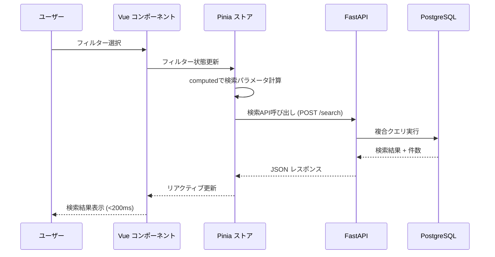
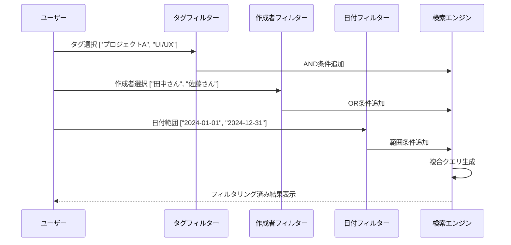
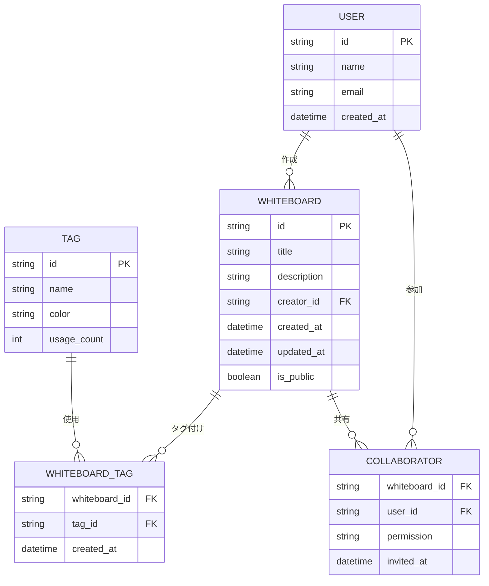
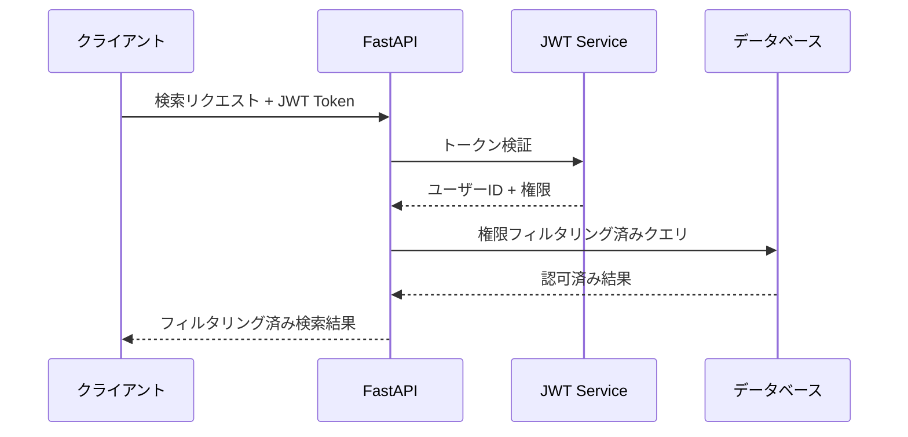

# 技術設計

## 概要

ホワイトボードアプリケーションに高度な検索機能を実装するための包括的な技術設計です。Vue 3 + TypeScript + Tailwind CSSのフロントエンド、FastAPI + PostgreSQLのバックエンドアーキテクチャを活用し、リアルタイムで高性能な検索体験を提供します。マルチフィルター（タグ、作成者、日付範囲）の組み合わせ、瞬時のUIフィードバック、スケーラブルなデータベース設計により、大量のホワイトボードコンテンツから目的の情報を効率的に発見できる機能を実現します。

## 要件マッピング

### 設計コンポーネントのトレーサビリティ

各設計コンポーネントは特定の要件に対応：

- **SearchFilterComponent** → REQ-1.1-1.6：タグによる検索・絞り込み機能
- **AuthorFilterComponent** → REQ-2.1-2.6：作成者による検索・絞り込み機能  
- **DateRangeFilterComponent** → REQ-3.1-3.7：日付範囲による検索・絞り込み機能
- **SearchStateManager (Pinia)** → REQ-4.1-4.6：複合検索とフィルター管理
- **SearchResultsComponent** → REQ-5.1-5.6：検索結果の表示と操作
- **SearchService (FastAPI)** → REQ-6.1-6.6：パフォーマンスと可用性要件

### ユーザーストーリーカバレッジ

- **タグ検索ユーザーストーリー**：@vueform/multiselectによるタグ選択UI、リアルタイム候補表示、AND検索実装
- **作成者検索ユーザーストーリー**：ユーザー選択コンポーネント、権限フィルタリング、クイックフィルター機能
- **日付範囲検索ユーザーストーリー**：Vue Tailwind Datepickerによる日付選択、プリセット範囲、バリデーション
- **複合検索ユーザーストーリー**：Piniaによる状態管理、リアルタイム更新、フィルター可視化
- **検索結果確認ユーザーストーリー**：ページネーション、ソート機能、件数表示、レスポンシブ表示
- **高性能検索ユーザーストーリー**：200ms以内応答、エラーハンドリング、キャッシュ機能、モバイル最適化

## アーキテクチャ

### システム全体アーキテクチャ

```mermaid
graph TB
    A[Vue 3 フロントエンド] --> B[FastAPI バックエンド]
    B --> C[PostgreSQL データベース]
    A --> D[Pinia ステート管理]
    B --> E[SQLAlchemy ORM]
    C --> F[GIN インデックス]
    A --> G[@vueform/multiselect]
    A --> H[Vue Tailwind Datepicker]
    B --> I[fastapi-pagination]
    B --> J[asyncpg コネクションプール]
    
    subgraph "フロントエンド レイヤー"
        A
        D
        G
        H
    end
    
    subgraph "バックエンド レイヤー"
        B
        E
        I
        J
    end
    
    subgraph "データ レイヤー"
        C
        F
    end
```

### テクノロジースタック

調査結果に基づく最適化された技術選択：

- **フロントエンド**：Vue 3 + TypeScript + Composition API + Tailwind CSS
- **状態管理**：Pinia + pinia-plugin-persistedstate
- **UIコンポーネント**：@vueform/multiselect + Vue Tailwind Datepicker
- **バックエンド**：FastAPI + asyncpg + SQLAlchemy 2.0
- **データベース**：PostgreSQL + GINインデックス
- **ページネーション**：fastapi-pagination
- **テスト**：Vitest + Playwright

### アーキテクチャ決定理由

調査に基づく主要技術選択の根拠：

- **Vue 3 Composition APIを選ぶ理由**：リアクティブなフィルタリング実装が効率的、TypeScript統合による型安全性、computedプロパティによる自動キャッシュ機能
- **@vueform/multiselectを選ぶ理由**：Vue 3 + TypeScript完全対応、Tailwind CSSネイティブサポート、タグ・オートコンプリート・マルチセレクト統合
- **PostgreSQL + GINインデックスを選ぶ理由**：全文検索の高性能、複合インデックスによる複数条件検索最適化、既存アーキテクチャとの整合性
- **asyncpg + FastAPIを選ぶ理由**：非同期処理によるスループット向上、コネクションプールによるリソース効率化、200ms応答時間要件の達成

## データフロー

### 検索処理のデータフロー



### 主要ユーザーフロー

**マルチフィルター検索フロー：**



## コンポーネントとインターフェース

### フロントエンドコンポーネント

| コンポーネント名 | 責任 | Props/State 要約 |
|-----------------|------|------------------|
| SearchPage | 検索ページ全体の統合 | filters: SearchFilters, results: WhiteboardSearchResult[] |
| SearchFilters | フィルター UI の統合 | modelValue: FilterState, availableTags: Tag[], availableUsers: User[] |
| TagFilter | タグ選択とオートコンプリート | selectedTags: string[], availableTags: Tag[], searchable: boolean |
| AuthorFilter | 作成者選択とクイックフィルター | selectedAuthors: string[], availableUsers: User[], showMyBoards: boolean |
| DateRangeFilter | 日付範囲選択とプリセット | dateRange: DateRange, presets: DatePreset[], validation: boolean |
| SearchResults | 検索結果表示とページネーション | results: WhiteboardSearchResult[], pagination: PaginationState, sortBy: SortOption |
| ResultCard | 個別ホワイトボードカード | whiteboard: WhiteboardSearchResult, showTags: boolean, clickable: boolean |

### バックエンドサービス & メソッドシグネチャ

```python
class SearchService:
    def search_whiteboards(self, filters: SearchFilters, pagination: PaginationParams) -> SearchResponse:
        """フィルター条件に基づくホワイトボード検索とページネーション実行"""
    
    def get_available_tags(self, user_id: str) -> List[Tag]:
        """ユーザーがアクセス可能なタグ一覧を取得"""
    
    def get_available_authors(self, user_id: str) -> List[User]:
        """ホワイトボード作成者一覧を取得（権限フィルタリング済み）"""
    
    def validate_search_filters(self, filters: SearchFilters) -> ValidationResult:
        """検索フィルターのバリデーション実行"""

class WhiteboardRepository:
    async def find_by_filters(self, filters: SearchFilters) -> List[Whiteboard]:
        """複合条件でのホワイトボード検索実行"""
    
    async def count_by_filters(self, filters: SearchFilters) -> int:
        """検索結果件数を取得"""
    
    async def get_distinct_tags(self, user_id: str) -> List[str]:
        """ユーザーアクセス可能なタグ一覧取得"""
```

### API エンドポイント

| メソッド | ルート | 目的 | 認証 | ステータスコード |
|----------|-------|------|------|------------------|
| POST | /api/v1/search/whiteboards | ホワイトボード検索実行 | 必須 | 200, 400, 401, 500 |
| GET | /api/v1/search/tags | 利用可能タグ一覧取得 | 必須 | 200, 401, 500 |
| GET | /api/v1/search/authors | 作成者一覧取得 | 必須 | 200, 401, 500 |
| POST | /api/v1/search/validate | 検索フィルターバリデーション | 必須 | 200, 400, 401, 500 |

## データモデル

### ドメインエンティティ

1. **SearchFilters**：検索条件の集約オブジェクト（タグ、作成者、日付範囲）
2. **WhiteboardSearchResult**：検索結果用のホワイトボード表現（必要フィールドのみ）
3. **Tag**：タグエンティティ（名前、使用回数、カテゴリ）
4. **DateRange**：日付範囲オブジェクト（開始日、終了日、バリデーション）
5. **PaginationState**：ページネーション状態管理
6. **SortOption**：ソート設定（フィールド、方向）

### エンティティ関係



### データモデル定義

**TypeScriptインターフェース：**

```typescript
interface SearchFilters {
  tags: string[];
  authors: string[];
  dateRange: {
    start: Date | null;
    end: Date | null;
    type: 'created' | 'updated';
  };
  sortBy: 'created_at' | 'updated_at' | 'title';
  sortOrder: 'asc' | 'desc';
}

interface WhiteboardSearchResult {
  id: string;
  title: string;
  description: string;
  creator: {
    id: string;
    name: string;
    avatar?: string;
  };
  tags: Tag[];
  createdAt: Date;
  updatedAt: Date;
  isPublic: boolean;
  collaboratorCount: number;
}

interface SearchResponse {
  results: WhiteboardSearchResult[];
  total: number;
  page: number;
  pageSize: number;
  hasNext: boolean;
}
```

**Pythonデータクラス：**

```python
@dataclass
class SearchFilters:
    tags: List[str] = field(default_factory=list)
    authors: List[str] = field(default_factory=list)
    date_range: Optional[DateRange] = None
    sort_by: str = 'updated_at'
    sort_order: str = 'desc'

@dataclass
class WhiteboardSearchResult:
    id: str
    title: str
    description: str
    creator: UserSummary
    tags: List[Tag]
    created_at: datetime
    updated_at: datetime
    is_public: bool
    collaborator_count: int

@dataclass
class SearchResponse:
    results: List[WhiteboardSearchResult]
    total: int
    page: int
    page_size: int
    has_next: bool
```

### データベーススキーマ

**最適化されたインデックス戦略：**

```sql
-- 複合検索用インデックス
CREATE INDEX idx_whiteboard_search ON whiteboards 
(creator_id, created_at DESC, updated_at DESC) 
WHERE deleted_at IS NULL;

-- タグ検索用GINインデックス
CREATE INDEX idx_whiteboard_tags_gin ON whiteboard_tags 
USING gin(tag_id);

-- 全文検索用GINインデックス
CREATE INDEX idx_whiteboard_fulltext ON whiteboards 
USING gin(to_tsvector('japanese', title || ' ' || description));

-- 権限チェック用インデックス
CREATE INDEX idx_collaborator_lookup ON collaborators 
(user_id, whiteboard_id, permission);
```

### マイグレーション戦略

- **段階的インデックス作成**：CONCURRENTLY オプションでロックフリー作成
- **統計情報更新**：検索パフォーマンス維持のため定期実行
- **パーティショニング**：将来的な大量データ対応（日付ベース）
- **アーカイブ戦略**：古いホワイトボードの段階的移行

## エラーハンドリング

### フロントエンドエラーハンドリング

```typescript
class SearchErrorHandler {
  handleSearchError(error: ApiError): void {
    switch(error.status) {
      case 400:
        this.showValidationErrors(error.details);
        break;
      case 401:
        this.redirectToLogin();
        break;
      case 500:
        this.showGenericError('検索中にエラーが発生しました');
        break;
      default:
        this.showNetworkError();
    }
  }
}
```

### バックエンドエラーハンドリング

```python
@app.exception_handler(ValidationError)
async def validation_exception_handler(request: Request, exc: ValidationError):
    return JSONResponse(
        status_code=400,
        content={
            "error": "VALIDATION_ERROR",
            "message": "検索条件が無効です",
            "details": exc.errors()
        }
    )

@app.exception_handler(DatabaseError)
async def database_exception_handler(request: Request, exc: DatabaseError):
    logger.error(f"Database error in search: {exc}")
    return JSONResponse(
        status_code=500,
        content={
            "error": "DATABASE_ERROR", 
            "message": "検索処理中にエラーが発生しました"
        }
    )
```

## セキュリティ考慮事項

### 認証と認可

**JWT認証フロー：**



**認可マトリックス：**

| ロール | 自分のホワイトボード | 共有されたホワイトボード | パブリックホワイトボード | 管理機能 |
|--------|---------------------|------------------------|------------------------|----------|
| ゲスト | ❌ | ❌ | ✅ | ❌ |
| ユーザー | ✅ | ✅ | ✅ | ❌ |
| 管理者 | ✅ | ✅ | ✅ | ✅ |

### データ保護

- **入力検証**：Pydanticスキーマによる厳密な型チェック
- **SQLインジェクション防止**：SQLAlchemyクエリビルダーの使用
- **権限チェック**：全検索クエリに自動的な権限フィルタリング適用
- **データ暗号化**：機密フィールドの暗号化（保存時・転送時）

### セキュリティベストプラクティス

- **OWASP Top 10軽減策**：入力検証、認証、セッション管理、アクセス制御
- **APIレート制限**：検索API に 100req/min/user の制限
- **CORS設定**：許可されたオリジンのみアクセス可能
- **セキュリティヘッダー**：HSTS、CSP、X-Frame-Options の実装

## パフォーマンスとスケーラビリティ

### パフォーマンス目標

| 指標 | 目標 | 測定 |
|------|------|------|
| 検索レスポンス時間（p95） | < 200ms | API エンドポイント |
| 検索レスポンス時間（p99） | < 500ms | API エンドポイント |
| 同時検索処理 | > 1000 req/sec | 負荷テスト |
| データベースクエリ（p99） | < 50ms | クエリ監視 |
| フロントエンドレンダリング | < 100ms | ブラウザDevTools |

### キャッシュ戦略

- **ブラウザキャッシュ**：タグ一覧、ユーザー一覧（5分間）
- **APIレスポンスキャッシュ**：Redis活用、検索結果（1分間）
- **データベースキャッシュ**：PostgreSQL shared_buffers 最適化
- **アプリケーションキャッシュ**：頻繁な検索パターンのメモ化

### スケーラビリティアプローチ

- **水平スケーリング**：FastAPIアプリケーションサーバーの複数インスタンス
- **データベース最適化**：読み取りレプリカ、接続プール
- **非同期処理**：バックグラウンドでのインデックス更新
- **CDN活用**：静的アセットの配信最適化

## テスト戦略

### テストカバレッジ要件

- **ユニットテスト**：≥90%コードカバレッジ（ビジネスロジック）
- **統合テスト**：全検索API エンドポイントとデータベース統合
- **E2E テスト**：主要検索シナリオのエンドツーエンド
- **パフォーマンステスト**：検索負荷テスト（1000同時ユーザー）

### テストアプローチ

1. **ユニットテスト（Vitest）**
   ```typescript
   describe('SearchFilters', () => {
     it('should validate date range correctly', () => {
       const filters = new SearchFilters();
       expect(filters.validateDateRange(start, end)).toBe(true);
     });
   });
   ```

2. **統合テスト（pytest）**
   ```python
   async def test_search_whiteboards_with_filters():
       response = await client.post("/api/v1/search/whiteboards", 
                                   json={"tags": ["test"], "authors": ["user1"]})
       assert response.status_code == 200
       assert len(response.json()["results"]) > 0
   ```

3. **E2Eテスト（Playwright）**
   ```typescript
   test('advanced search workflow', async ({ page }) => {
     await page.goto('/search');
     await page.fill('[data-testid="tag-input"]', 'プロジェクト');
     await page.click('[data-testid="search-button"]');
     await expect(page.locator('[data-testid="search-results"]')).toBeVisible();
   });
   ```

### CI/CDパイプライン


**パイプライン詳細：**
- **並列実行**：フロントエンド・バックエンドテストの同時実行
- **失敗時の早期停止**：任意のステップ失敗で即座に停止
- **アーティファクト保存**：テストレポート、カバレッジレポート
- **自動ロールバック**：本番デプロイ失敗時の自動復旧