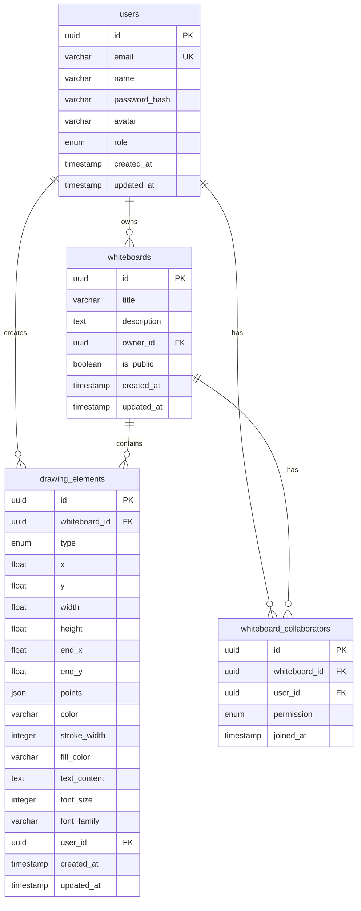

# ER図（Entity Relationship Diagram）

## 概要
本資料は、リアルタイム協調ホワイトボードアプリケーションのデータベース構造を示すER図です。

## 実装状況
- **実装済みテーブル**: users, whiteboards, drawing_elements, whiteboard_collaborators
- **未実装テーブル**: user_sessions, activity_logs（将来実装予定）

## 実装済みER図

## 将来実装予定ER図

## 実装済みテーブル関係説明

### 1. users（ユーザー）
- **主キー**: id (UUID)
- **ユニークキー**: email
- **ENUM型**: role ('user', 'admin')
- **説明**: システムのユーザー情報を管理

### 2. whiteboards（ホワイトボード）
- **主キー**: id (UUID)
- **外部キー**: owner_id → users.id
- **説明**: ホワイトボードの基本情報を管理
- **関係**: 各ホワイトボードは1人のオーナー（users）を持つ

### 3. drawing_elements（描画要素）
- **主キー**: id (UUID)
- **外部キー**: 
  - whiteboard_id → whiteboards.id
  - user_id → users.id
- **ENUM型**: type ('pen', 'line', 'rectangle', 'circle', 'text', 'sticky')
- **説明**: ホワイトボード上の描画要素を管理
- **関係**: 各描画要素は1つのホワイトボードに属し、1人の作成者を持つ

### 4. whiteboard_collaborators（コラボレーター）
- **主キー**: id (UUID)
- **外部キー**:
  - whiteboard_id → whiteboards.id
  - user_id → users.id
- **ユニーク制約**: (whiteboard_id, user_id)
- **ENUM型**: permission ('view', 'edit', 'admin')
- **説明**: ホワイトボードの共有・権限情報を管理
- **関係**: ユーザーとホワイトボードの多対多関係を表現

## 将来実装予定テーブル説明

### 5. user_sessions（セッション）
- **主キー**: id (UUID)
- **外部キー**: user_id → users.id
- **ユニークキー**: session_token
- **説明**: ユーザーのセッション情報を管理
- **関係**: 各セッションは1人のユーザーに属する

### 6. activity_logs（アクティビティログ）
- **主キー**: id (UUID)
- **外部キー**:
  - user_id → users.id (NULL可)
  - whiteboard_id → whiteboards.id (NULL可)
- **説明**: システム全体のアクティビティを記録
- **関係**: ユーザーやホワイトボードの活動を追跡

## データ型説明

### 実装済みENUM型
- **userrole**: 'user', 'admin'
- **drawingtype**: 'pen', 'line', 'rectangle', 'circle', 'text', 'sticky'
- **permission**: 'view', 'edit', 'admin'

### JSON型
- **points**: ペンストローク用の座標配列 [{"x": 10, "y": 20}, ...]

### 将来実装予定ENUM型
- **activity_type**: 'user_login', 'user_logout', 'whiteboard_created', など

### 将来実装予定JSONB型
- **details**: アクティビティの詳細情報

## 関係性の詳細

### 実装済み関係

1. **1対多関係**
   - users → whiteboards（1人のユーザーが複数のホワイトボードを所有）
   - users → drawing_elements（1人のユーザーが複数の描画要素を作成）
   - whiteboards → drawing_elements（1つのホワイトボードが複数の描画要素を含む）

2. **多対多関係**
   - users ↔ whiteboards（whiteboard_collaboratorsテーブルを介して）

3. **カスケード削除**
   - ユーザー削除時：
     - 所有するホワイトボード: CASCADE削除
     - 作成した描画要素: SET NULL（user_idがNULLになる）
     - コラボレーター情報: CASCADE削除
   - ホワイトボード削除時：
     - 描画要素: CASCADE削除
     - コラボレーター情報: CASCADE削除

### 将来実装予定関係

1. **1対多関係**
   - users → user_sessions（1人のユーザーが複数のセッションを持つ）
   - users → activity_logs（1人のユーザーが複数のアクティビティを生成）
   - whiteboards → activity_logs（1つのホワイトボードが複数のアクティビティを持つ）

## インデックス戦略

### 実装済みインデックス
- users.emailにユニークインデックス
- 外部キーカラムにPostgreSQLが自動でインデックスを作成

### 推奨追加インデックス
- 検索頻度の高いカラムにインデックス追加
- パフォーマンス最適化のための複合インデックス

## 関連資料
- [テーブル定義書](./01_テーブル定義書.md)
- [API設計書](../04_API設計/)
- [データベース移行手順](../../04_開発ガイドライン/)

---
**作成日**: 2024年7月6日  
**更新日**: 2025年7月7日  
**作成者**: データベース設計チーム  
**更新者**: 実装チーム  
**版数**: 2.0.0（実装準拠版）