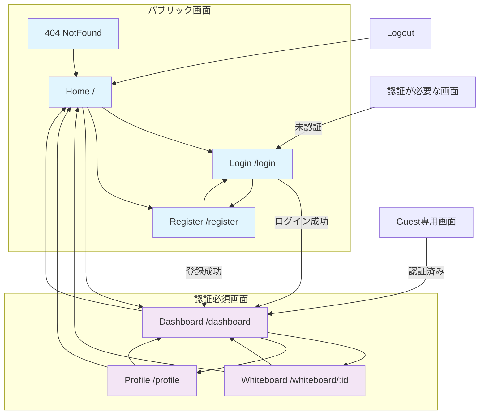

# 画面遷移図

## 概要
本資料は、リアルタイム協調ホワイトボードアプリケーションの画面遷移を示すMermaid記法の画面遷移図です。

## 画面遷移図



## 画面一覧

### パブリック画面（認証不要）
| 画面名 | パス | 概要 |
|--------|------|------|
| Home | `/` | アプリケーションのランディングページ |
| Login | `/login` | ユーザーログイン画面 |
| Register | `/register` | ユーザー新規登録画面 |
| NotFound | `/404` | 404エラー画面 |

### 認証必須画面
| 画面名 | パス | 概要 |
|--------|------|------|
| Dashboard | `/dashboard` | ユーザーダッシュボード（ホワイトボード一覧） |
| Whiteboard | `/whiteboard/:id` | ホワイトボード編集画面 |
| Profile | `/profile` | ユーザープロフィール設定画面 |

## 画面遷移の特徴

### 1. 認証状態による分岐
- **未認証ユーザー**：Home → Login/Register → Dashboard
- **認証済みユーザー**：Home → Dashboard → Whiteboard/Profile

### 2. ルートガード
- **認証必須画面**（`requiresAuth: true`）への未認証アクセス → Login画面へリダイレクト
- **Guest専用画面**（`guestOnly: true`）への認証済みアクセス → Dashboard画面へリダイレクト

### 3. エラーハンドリング
- **不正なURL** → 404画面
- **セッション切れ** → 自動ログアウト → Home画面
- **API/ネットワークエラー** → 現在画面でエラー表示

### 4. 特殊な遷移
- **WebSocketによるリアルタイム接続**
- **ディープリンク対応**（ホワイトボード直接アクセス）
- **モバイル対応ナビゲーション**

## 技術的な実装詳細

### Vue Router設定
```javascript
// 認証が必要な画面
{ path: '/dashboard', component: DashboardView, meta: { requiresAuth: true } }
{ path: '/whiteboard/:id', component: WhiteboardView, meta: { requiresAuth: true } }
{ path: '/profile', component: ProfileView, meta: { requiresAuth: true } }

// Guest専用画面
{ path: '/login', component: LoginView, meta: { guestOnly: true } }
{ path: '/register', component: RegisterView, meta: { guestOnly: true } }
```

### ナビゲーションガード
```javascript
router.beforeEach((to, from, next) => {
  // 認証状態チェック
  // リダイレクト処理
  // エラーハンドリング
});
```

### 状態管理
- **Pinia Store**による認証状態管理
- **WebSocket接続**の状態管理
- **ホワイトボード状態**の永続化

## 関連資料
- [API設計書](../04_API設計/)
- [画面詳細設計](./03_画面詳細/)
- [セキュリティ設計](../06_セキュリティ設計/)